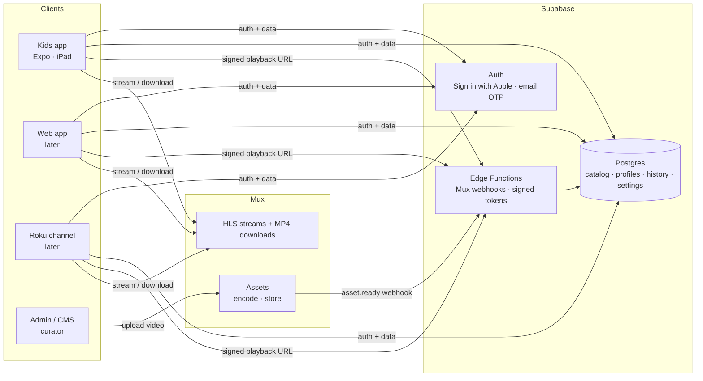

# Turnip Learning — Architecture Review & Rebuild Plan

*September 2026 · Status: **proposal, awaiting sign-off** · Replaces [archive/system-design-v0.md](archive/system-design-v0.md)*

## TL;DR

Rebuild the whole thing. The v0 code is small (~2,900 lines) and its value is the *design*, which already lives in [`design/app-screens`](../design/app-screens). Its foundation (Expo SDK 51, native Firebase, a hand-patched `ios/` folder) is where almost all the effort went, and none of it carries forward.

| Layer | Decision |
|---|---|
| **Kids app** | Expo SDK 57 + Expo Router, one universal iOS app for **iPad + iPhone**, no committed `ios/` folder |
| **Video files** | **Mux** — HLS streaming + a signed MP4 per video for offline |
| **Video player** | `expo-video` (Expo's own player; replaces `react-native-video`) |
| **Offline** | Download the Mux MP4 with `expo-file-system`, play the local file |
| **Data + auth** | **Supabase** (Postgres) — catalog, parents, child profiles, history, settings. *Never* video files. |
| **Admin / CMS** | Phase 1: Supabase dashboard + Mux dashboard. Phase 2: small Next.js admin. |
| **Analytics** | First-party only (events table in Supabase). No Mux Data, Sentry, PostHog, Firebase Analytics in the kids app. |
| **Roku / web** | Later. Same Supabase API + same Mux HLS streams; Roku is a separate small app. |

---

## 1. What we're building (constraints that drive the design)

From the PRDs, business model canvas, and pitch material in [`docs/`](.):

- **Users:** kids ~3–9 (many pre-readers) and their parents. Later: teachers and schools.
- **Product:** curated, interest-based video "journeys" (animals, ocean, science, engines, dance…). No user uploads, no ads, no algorithmic feed.
- **Platforms:** iPad **and iPhone** at launch (one universal iOS app). Then Android, web, Roku.
- **Must-haves:** child profiles, parental controls (time limits, topic filters), offline downloads (car trips), parent-gated settings.
- **Legal:** COPPA (2025 amendments — full compliance required since **April 22, 2026**) and Apple's **Kids Category** rules.
- **Team reality:** one founder-developer using AI tools. Every choice should minimize native build work and ops.

## 2. Review of v0 (what we have today)

| Area | Assessment | Carry forward? |
|---|---|---|
| Visual design (Magic Patterns → RN) | Strong. Purple/green palette, Quicksand, mascot, big kid-sized controls. | ✅ Port theme tokens, fonts, mascot, splash |
| Video player UX | Good kid-first layout (giant Play / Go Home). | ✅ Port the UX, rewrite on `expo-video` |
| Mux URL helpers (`lib/mux.ts`) | Correct and tiny. | ✅ Reuse |
| Expo SDK 51 / RN 0.74 | Two years old; doesn't officially support Xcode 26 → caused most build failures. | ❌ |
| `@react-native-firebase` | Never actually used, but pulled in gRPC + BoringSSL → all the Podfile hacks. | ❌ |
| Committed, hand-patched `ios/` + `withBoringSSLFix` plugin | Fragile; one `expo prebuild` wipes the fixes. | ❌ |
| `react-native-video` | Fine, but `expo-video` is now the first-party default. | ❌ |
| Data access | Every screen imports a hard-coded array; two conflicting video types. | ❌ Replace with a data layer |
| Bundled videos (537 MB) | Dev scaffolding. | ❌ Upload to Mux |
| Login / profiles | UI only, not wired, not reachable. | 🔁 Rebuild with real auth |
| `apps/admin` | Placeholder page. | ❌ Rebuild in phase 2 |
| `packages/shared` | Hand-written types that already disagree with the app. | 🔁 Generate from the database schema |

## 3. Target architecture



**Key idea:** the apps talk to Supabase for *what* to show and to Mux for *the video itself*. Supabase stores only a Mux `playback_id` per video.

## 4. Decisions

### 4.1 Client: Expo (React Native), not native Swift

- **Why:** one codebase for iPad, Android tablets, and web; best fit for AI-assisted development; Expo SDK 57 supports current Xcode with no manual Podfile work.
- **How:** Continuous Native Generation — `ios/` and `android/` are generated, gitignored, and never hand-edited. Any native tweak goes in `app.config.ts` or a config plugin. Builds via EAS.
- **Roku** can't run React Native under any option; it will be a small separate BrightScript/SceneGraph channel reusing the same API and HLS streams. That's a phase 3 concern and doesn't change this choice.
- **Alternative considered:** SwiftUI native. Better iPad polish, but locks us to Apple and doubles the work for Android/web.

#### iPhone + iPad (universal app)

One App Store listing, one binary (`ios.supportsTablet: true`). What changes versus the iPad-only v0:

| Topic | iPad | iPhone |
|---|---|---|
| Orientation | Landscape (and resizable windows — see note) | Browse screens in **portrait and landscape**; player rotates to landscape full-screen |
| Layout | Current two-column / grid layouts | Single column, horizontal carousels, bottom tab bar |
| Touch targets | Giant (200 × 160 pt play button) | Still kid-sized (≥ 64 pt), scaled to screen width |
| Downloads | 720p MP4 | 480p or 720p (smaller files), with a storage-used indicator |
| Typical user | Child | Child **and** parent (settings, profiles, downloads to hand the phone over in the car) |

- **Layout strategy:** build screens responsive from day one using window size (`useWindowDimensions`) with two breakpoints — *compact* (iPhone, iPad split view) and *regular* (iPad full screen). No separate iPhone and iPad screen files.
- **Design gap:** the Magic Patterns designs are iPad-landscape only. We need iPhone versions of Home, Browse, Player, Profile picker, and Login — generate them in Magic Patterns or design them directly in code from the same tokens.
- **iPad multitasking — verify:** v0 set `UIRequiresFullScreen` to force full-screen on iPad. Check whether iPadOS 26 still honors it; if not, the "compact" layout also covers iPad split view, so the responsive approach handles it either way.
- **App Store:** screenshots needed for both 6.9″ iPhone and 13″ iPad.

### 4.2 Video hosting: Mux

| Option | Verdict |
|---|---|
| **Mux** | ✅ **Recommended.** Upload once → adaptive HLS stream + thumbnails + optional downloadable MP4. Basic-quality encoding free, first 100k delivery minutes/month free (≈ free at pilot scale). Signed playback for licensed content. Plays on iOS, Android, web, Roku. |
| Cloudflare Stream | Close second. Simple flat pricing ($5/1k min stored, $1/1k min delivered). Choose if cost predictability matters more than tooling. |
| Bunny Stream | Cheapest, but weaker playback protection and bundled viewer analytics we'd have to avoid. |
| AWS (S3 + MediaConvert + CloudFront) | Cheapest at huge scale, but you build everything yourself. Not for a one-person team. |
| **Supabase / Firebase Storage** | ❌ These are file buckets, not video platforms: no transcoding, no adaptive streaming (videos stall on weak car Wi-Fi), expensive egress. Fine for thumbnails and avatars only. |

⚠️ **Do not enable Mux Data** in the kids app. Track plays ourselves (§4.7).

Since the content is our own, the pilot uses **public** playback IDs (no tokens). Signed playback is turned on when subscriptions launch.

### 4.3 Playback & offline

- **Streaming:** `expo-video` with the Mux HLS URL. Supports captions/subtitle tracks, Picture-in-Picture, and FairPlay DRM if a content partner ever requires it.
- **Offline:** `expo-video` has no download feature and can't cache HLS on iOS. Instead:
  1. Enable Mux **static MP4 renditions** — 720p for iPad, 480p option for iPhone to save storage.
  2. Parent taps "Download" → app fetches the (signed) MP4 URL with the `expo-file-system` download task API (progress, cancel, resume) into the app's documents folder.
  3. Record the download in local SQLite (`expo-sqlite`): video id, file path, size, expiry.
  4. Player uses the local `file://` path when present, otherwise streams.
- **To verify during build:** whether downloads continue when the app is backgrounded on iOS.

### 4.4 Data & auth backend: Supabase

| Option | Verdict |
|---|---|
| **Supabase** | ✅ **Recommended.** Postgres fits our data (journeys, profiles, watch history, and later schools → classes → students, plus parent/teacher reports). Row-level security isolates each family and school in the database itself. Pure JS client — no native build pain. Sign in with Apple + email OTP. SOC 2 Type 2, DPA available, choose a US region. Free tier to start; Pro $25/mo for production. Standard Postgres = low lock-in. |
| Firebase (JS SDK) | Works, but: no persistent offline cache in React Native, document model is awkward for school rosters/reports, high lock-in, and Google Analytics must be kept out of a Kids app. |
| Convex | Great developer experience, but document model, auth via third party, and data-region details unclear. |

Supabase does **not** store video. It stores the catalog row that points at Mux.

### 4.5 Data model (first pass)

```
auth.users                  ← parent accounts (managed by Supabase Auth)
households       id, owner_user_id, consent_given_at, created_at
child_profiles   id, household_id, nickname, avatar_id, age_band ('3-5' | '6-9')
parental_settings profile_id, daily_limit_min, allowed_topic_ids[], downloads_allowed

topics           id, slug, name, emoji, color
videos           id, title, description, duration_s, age_min, age_max,
                 mux_asset_id, mux_playback_id, status ('preparing'|'ready'|'errored'),
                 thumbnail_time_s, is_published, published_at
video_topics     video_id, topic_id
journeys         id, title, description, cover_video_id, age_min, age_max, sort_order
journey_items    journey_id, video_id, position

watch_progress   profile_id, video_id, seconds_watched, completed_at, updated_at
events           id, profile_id, type, video_id, payload jsonb, created_at   ← first-party analytics

-- Phase 3 (schools)
organizations, classrooms, classroom_members, assignments
```

Privacy by design: child profiles hold **only a nickname, an avatar, and an age band** — no birthdate, no email, no photo.

### 4.6 Content pipeline & admin

- **Phase 1 (launch):** curator uploads in the **Mux dashboard** → a Supabase Edge Function receives Mux's `video.asset.ready` webhook and creates the `videos` row → curator fills in title/topics/journeys in the **Supabase table editor**. Zero custom admin code.
- **Phase 2:** a small Next.js admin (`apps/admin`) with Mux Direct Uploads, a topic/journey editor, and publish/unpublish.

### 4.7 Kids Category & COPPA compliance (built in, not bolted on)

| Requirement | Design response |
|---|---|
| Parental gate before settings, external links, purchases | Reusable `ParentGate` component (e.g., "hold the button + solve 7 × 4"), spoken prompt for pre-readers |
| No third-party analytics/ads in kids app | First-party `events` table only. No Mux Data, Sentry, PostHog, Firebase Analytics, Meta/Google SDKs. |
| Minimal data from kids | Profiles = nickname + avatar + age band. Watch history keyed to internal profile ID. |
| Verifiable parental consent (COPPA) | Parent creates the account (Sign in with Apple / email OTP) and completes an explicit consent step before any child profile exists; `consent_given_at` recorded. |
| Separate consent before sharing child data with third parties (2025 rule) | We don't share any. Mux receives only signed playback requests with no viewer metadata. |
| Written data-retention policy; no indefinite retention (2025 rule) | Scheduled job deletes `events` after N months; "Delete my family's data" + export in parent settings. |
| Written information-security program (2025 rule) | Document in `docs/security.md`; RLS on every table; DPAs with Supabase and Mux. |
| Schools (phase 3) | FTC edtech guidance: school may consent only for purely educational use under school control. Separate data path for `organizations`. |

### 4.8 Payments (later)

Subscriptions sold inside the iOS app must use Apple In-App Purchase, and in a Kids Category app the purchase flow must sit behind the parental gate. Whether a third-party subscription SDK (e.g. RevenueCat) is acceptable in a Kids Category app needs checking before we add one. Not needed for the pilot.

## 5. Repo structure after the rebuild

```
apps/
  kids/            Expo SDK 57 app (iPad-first; web later)
  admin/           Next.js CMS (phase 2)
packages/
  db/              Supabase migrations, seed data, generated TypeScript types
  ui/              Theme tokens, fonts, shared components (optional)
supabase/
  functions/       Edge Functions: mux-webhook, playback-token
design/            Magic Patterns source designs + app icon
docs/              This doc, PRD, business docs, archive
```

## 6. Cost at pilot scale (≈ 100 families)

| Service | Monthly |
|---|---|
| Mux (under 100k delivery min, basic encoding) | ~$0 (pay-as-you-go includes a $20 credit) |
| Supabase | $0 while building → $25 Pro at launch |
| EAS Build | $0 (free tier) → $19 if builds queue too long |
| Apple Developer Program | $99 / year |

## 7. Rebuild phases

1. **Foundation** — new Expo 57 app (`apps/kids`) running on iPad **and iPhone** simulators, theme + fonts + mascot ported, responsive layout primitives (compact/regular), Supabase project with schema + seed, 8 sample videos uploaded to Mux. *Outcome: app streams real Mux video from real catalog data on both devices.*
2. **Kid experience** — Home, Browse by topic, Journeys, Player (expo-video), "watch next" suggestions — each screen checked on iPhone and iPad.
3. **Parents** — sign-in, consent, child profiles, ParentGate, time limits, topic filters.
4. **Offline** — download manager, "My Videos" screen.
5. **Ship** — privacy policy, App Store Kids Category submission, TestFlight pilot with families at home.
6. **Later** — admin app, web, Android, schools, Roku, subscriptions.

## 8. Decisions & open questions

**Decided (Sept 29, 2026)**

- **Content source: Sarah's own videos.** No licensing terms or DRM to satisfy. Pilot uses Mux *public* playback IDs for streaming and MP4 downloads — simplest possible setup. Switch to *signed* playback (Edge Function `playback-token`) when paid subscriptions launch, so links can't be shared outside the app. Schema already supports it; no rework.
- **Pilot audience: families at home first.** School/classroom features (organizations, rosters, teacher assignments) stay in phase 6 and out of the pilot schema. Focus the pilot on parent onboarding, profiles, time limits, and offline downloads.
- **Devices: iPhone + iPad** in one universal iOS app.
- **Age range: 3–9**, with two content bands (3–5, 6–9). Supersedes the 3–8 and 5–12 ranges in the older PRDs.

- **Pilot platforms: iPhone + iPad only.** Android comes later; the Expo codebase stays Android-compatible, but it isn't tested or shipped for the pilot.

- **Designs:** the rebuild adapts the current iPad designs for iPhone now. Sarah redoes the app designs starting **Oct 1, 2026**. So every screen is built from shared theme tokens and components (`apps/kids/src/theme`, `apps/kids/src/components/ui`) — the redesign should be a reskin, not a rewrite.

## Appendix: facts not yet verified

- Whether `expo-file-system` downloads continue in the iOS background.
- Exact Firebase Storage egress and Convex data regions (not needed if we pick Supabase).
- Some prices come from 2026 third-party summaries; confirm on vendor pricing pages before budgeting.

**Sources:** mux.com/docs/pricing/video · mux.com/docs/guides/enable-static-mp4-renditions · mux.com/docs/guides/ensure-data-privacy-compliance · developers.cloudflare.com/stream/pricing · docs.expo.dev/versions/latest/sdk/video · docs.expo.dev/versions/latest/sdk/filesystem · supabase.com/docs/guides/security/soc-2-compliance · supabase.com/legal/dpa · developer.apple.com/app-store/kids-apps · federalregister.gov/documents/2025/04/22/2025-05904
