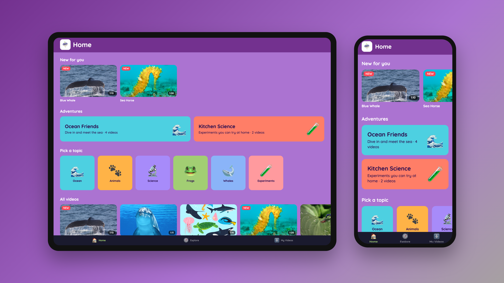

# Turnip Learning — portfolio write-up

## One-liner

A safe, curated video app for kids ages 3–9 — like YouTube, but built for learning instead of engagement.

## Short version (for a project card, ~50 words)

**Turnip Learning** is an iPhone and iPad app where young kids explore what they're obsessed with — whales, frogs, kitchen science — through curated video "adventures" instead of algorithm rabbit holes. I designed the product, wrote the architecture, and built the app in React Native (Expo) with AI-assisted development.

## Longer version (for a project page)

**The problem.** Parents love that kids can learn anything on a screen, but the default is YouTube: a platform built for engagement, with ads and endless recommendations. There's no great place for a curious 5-year-old to go deep on sea creatures safely.

**The product.** Turnip is a kid-first video app with big, touch-friendly cards, topics a pre-reader can pick by picture, curated multi-video adventures, and a player with giant Play and Go Home buttons. When a video ends, it suggests related videos from the same topic — never an open-ended feed.

**My role.** Founder, product designer, and developer. I wrote the PRD and business model, designed the screens in Magic Patterns, and built the app.

**How it's built**
- **App:** Expo SDK 57 / React Native, Expo Router, one codebase for iPhone and iPad with responsive layouts
- **Video:** Mux for adaptive streaming, with MP4 downloads planned for offline car trips; `expo-video` player
- **Data & auth (planned):** Supabase (Postgres with row-level security)
- **Design system:** all colors, type, and spacing in one token file, so a redesign is a reskin rather than a rewrite
- **Privacy by design:** follows Apple's Kids Category rules and the 2025 COPPA amendments — no third-party analytics or ads, parental gates, and child profiles that hold only a nickname, avatar, and age band

**What I learned.** The first prototype got stuck in native build problems caused by a dependency it didn't need. Rebuilding on a current, simpler stack — and writing the architecture down first — turned weeks of build debugging into a working app in a day.

**Status.** In active development (2026): the core kid experience runs on iPhone and iPad layouts; parent accounts, offline downloads, and a family pilot are next.

**Links:** [GitHub](https://github.com/sarahrittertech-commits/turniplearningapp)

## Screenshots

| | |
|---|---|
| `turnip-hero.png` | iPad + iPhone composite (cover image) |
| `home-ipad.png` | Home — iPad |
| `home-iphone.png` | Home — iPhone |
| `explore-iphone.png` | Explore topics — iPhone |
| `topic-ocean-ipad.png` / `topic-ocean-iphone.png` | Ocean topic |

Screenshots are from the app's web build at exact iPhone (393×852 @3x) and iPad (1366×1024 @2x) sizes.
